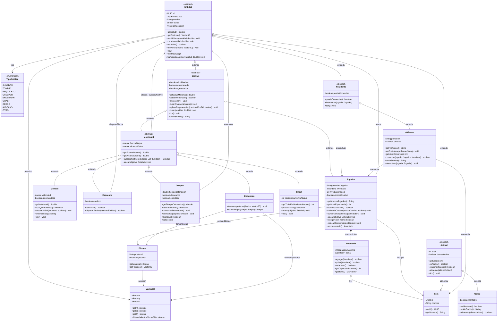

# NRodriguez-taller-git-2026
Taller Git 2026 - Modelado POO Minecraft con Spring Boot

## Diagrama de clases del modelo Minecraft

Diagrama generado a partir del código real ubicado en `src/main/java/py/edu/uc/lp3/minecraft/`.

### Herencia

`Entidad` es la clase abstracta raíz del modelo. De ella derivan `SerVivo` (salud máxima, veneno y regeneración), `Animal` (edad y domesticación) y `Residente` (posibilidad de comerciar).

De `SerVivo` derivan `Jugador` y la clase abstracta `MobHostil`. Los mobs hostiles concretos son `Zombie`, `Esqueleto`, `Creeper`, `Enderman` y `Ghast` (contribución fusionada).

De `Animal` deriva `Cerdo`, y de `Residente` deriva `Aldeano`.

### Composición y asociaciones

- `Jugador` mantiene una relación de **composición** con `Inventario` (capacidad 36).
- `Inventario` agrega **0..*** objetos de tipo `Item`.
- `Entidad` usa `Vector3D` para su posición y `TipoEntidad` para su tipo.
- `Bloque` es una clase independiente que también usa `Vector3D`.
- Asociaciones de uso: `Jugador.atacar(Entidad)`, `Jugador.colocarBloque(Bloque)`, `MobHostil.atacar/buscarObjetivo(Entidad)`, `Enderman.tomarBloque(Bloque)`, `Animal.alimentar(Item)`, `Residente.interactuar(Jugador)`, `Aldeano.comerciar(Jugador, Item)`.

### Comportamiento polimórfico `emitirSonido()`

`emitirSonido()` se declara abstracta en `Entidad`, se implementa genéricamente en `SerVivo` y se **sobrescribe** de forma polimórfica en `Zombie` (ej. "Grrr..."), `Cerdo` ("Oinc oinc") y `Aldeano` ("Hmm... ¿En qué puedo ayudarte?").

### Diagrama Mermaid

